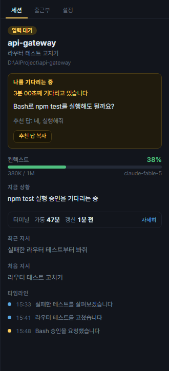
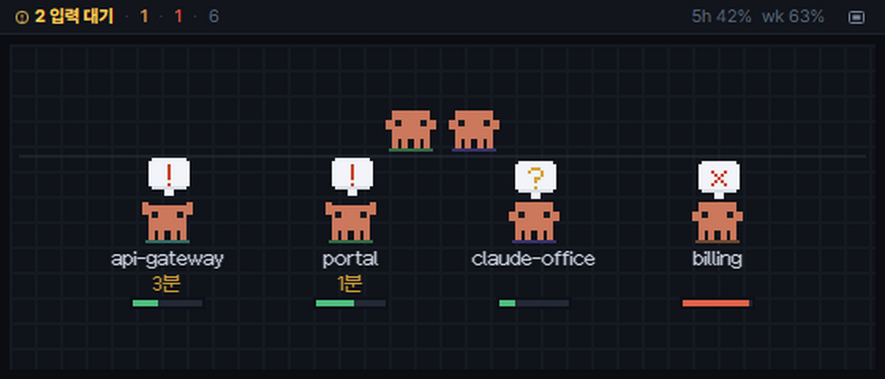

# claude-office

[English](README.md) · **한국어**

로컬에서 도는 Claude Code 세션을 픽셀 사무실로 그려 주는 트레이 상주 앱.
**작업 디렉터리 하나가 방 하나, 세션 하나가 그 방에서 일하는 클로드 하나다.**


세션을 돌려놓고 딴 일을 하다 돌아오면, 권한 확인 하나를 20분째 물고 기다리고 있는 일이 있다.
그걸 대신 흘끗 보라고 만든 사무실이고, 딴 데를 보고 있는 동안 대신 부르러 오는 앱이다.

[설치](#설치) ·
[화면 읽는 법](#화면-읽는-법) ·
[입력 대기](#입력-대기를-놓치지-않는다) ·
[패널](#패널) ·
[알림](#알림) ·
[창 다루기](#창-다루기) ·
[한계](#한계)

## 설치

**Windows** — [Releases](https://github.com/when630/claude-office/releases/latest)에서
`Claude-Office-Setup-x.y.z.exe`를 받아 실행한다. 코드 서명이 없어 SmartScreen이 막으면
`추가 정보 > 실행`.

**macOS** — 같은 곳에서 `Claude-Office-x.y.z-arm64.dmg`(Apple Silicon)나 `-x64.dmg`(Intel)를
받아 앱을 Applications에 끌어 넣는다. 서명도 공증도 없어서 "손상되었기 때문에 열 수 없습니다"가
뜨는데, 터미널에서 한 번만 풀어 주면 된다.

```bash
xattr -cr "/Applications/Claude Office.app"
```

따로 설치할 것은 없다. Claude Code가 이미 쓰고 있는 `~/.claude` 파일을 그대로 읽으므로,
이 컴퓨터에서 Claude Code를 쓰고 있다면 그걸로 끝이다.

**업데이트.** Windows 설치본은 네 시간마다 새 버전을 확인해 백그라운드로 받아 둔다. 준비되면
알림이 뜨고, **트레이 메뉴 > 업데이트 설치하고 재시작**으로 바로 적용하거나 그냥 두면 다음에
종료할 때 조용히 설치된다. 서명 없는 맥 빌드는 자동 설치가 막혀 있어 **알림만** 뜬다 — 누르면
Releases가 열린다.

## 화면 읽는 법

일하는 동안에는 자리에 앉아 타이핑한다. 일이 없으면 일어나 방을 돌아다니며 혼잣말을 하고,
가끔 옆자리와 잡담도 한다. 자판기나 정수기에 들러 컵을 들고 오고, 프린터는 종이를 뱉고
아케이드 기계는 혼자 깜빡인다.

| 세션 상태 | 사무실에서는 |
|---|---|
| 작업 중 | 자리에 앉아 키보드를 두드리고, 모니터에 코드가 흐른다 |
| 헤매는 중 | 자리에는 있는데 손이 멈춘다 — 느리게 머리를 긁적이고 ❓ 를 띄운다 |
| **서버 응답 없음** | 고개를 갸우뚱하고 머리 위로 별이 돈다 |
| **입력 대기** | 자리 앞으로 나와 두 집게를 들고 ❗ 를 든다 |
| 완료 | ✓ 를 들고 바닥으로 걸어 나가 산책한다 |
| 실패 · 정지 | 의자에 늘어져 있다 (✗ / zZ) |
| 대기 | 방을 어슬렁거리고, 가끔 다 같이 러그에 모인다 (점심에는 더 자주) |

**서버 응답 없음**은 헤매는 것과 다르다. 헤매는 것은 돌고는 있는데 진전이 없는 것이고, 이쪽은
Claude 쪽 문제(`API Error: 529 Overloaded` 같은 것)로 아예 돌지 못하는 것이다 — 들여다볼 일이
아니라 기다리면 되는 멈춤이라 따로 센다. 사용량 한도나 로그인 만료는 여기 들어가지 않는다.

글자 없이도 읽히는 것이 셋 더 있다.

- **말풍선.** 흰색에 왼쪽 파란 띠가 붙어 있으면 세션에서 실제로 읽어 온 말이고, 어두우면
  분위기용으로 써 둔 대사다.
- **이름표 아래 막대**는 그 세션의 컨텍스트 사용률이다(60% 노랑 · 85% 빨강). 차오를수록
  **책상에 서류가 쌓이고**, 책상이 다 차면 **바닥으로 흘러넘친다** — 각도가 제각각인 종이에
  구겨진 종이와 빈 캔이 섞인다. 막대를 읽지 않고 방만 훑어도 어느 자리가 곧 압축될지 눈에
  들어온다.
- **비서.** 서브에이전트가 도는 동안 결재판을 든 비서가 자리 옆에 서서 진행 상황을 보고한다.

방금 생긴 방에는 몇 초 동안 **이삿짐 박스**가 놓이고, 일이 다 끝난 방은 **불이 꺼진다.**
**밤 10시가 지나면 사무실 전체가 어두워진다** — 방 색은 그대로라 방끼리는 여전히 구분되고,
새벽까지 남아 있는 놈은 ♪ 를 띄우며 콧노래를 흥얼거린다.

화면 문구와 캐릭터 대사는 **한국어와 영어**를 지원한다. 기본은 OS 언어를 따라가고, 패널의
**설정** 탭이나 트레이 메뉴 > 언어에서 바꾼다. 재시작은 필요 없다.

## 입력 대기를 놓치지 않는다

권한 확인, 선택지, 플랜 승인 — 세션이 **내 답을 기다리는** 상태가 되는 순간들이다.
이걸 놓치지 않게 하는 것이 이 앱의 본론이다.


- 클로드가 **자리 앞으로 나와** ❗ 를 들고, 무엇을 기다리는지 말풍선으로 말한다
- 트레이 아이콘에 **노란 점**이 붙고 **OS 알림**(Windows 토스트 · 맥 알림)이 뜬다 — 누르면
  창이 열리면서 그 자리가 선택된다
- 상단바에 **`2 입력 대기 · 최장 3분` 칩**이 선다. 화면에서 배경이 채워진 것은 이것뿐이다.
  누르면 **가장 오래 기다린 자리**가 열린다. 왼쪽 세션 목록에도 같은 묶음이 맨 위에 서서
  1초마다 시간을 올린다
- 답하고 나면 칩도 묶음도 **통째로 사라진다**
- 답하지 않고 두면 **5 · 15 · 30 · 60분에 다시 부르고**, 5분을 넘기면 **트레이 아이콘이
  깜빡이기 시작한다.** 회의 중이거나 전체화면이면 토스트는 그냥 지나가 버리지만 트레이는
  계속 그 자리에 있다

프롬프트 앞에서 그냥 쉬고 있는 세션은 이것과 구분하므로, 세션이 끝날 때마다 알림이 울리지는
않는다.



자리를 누르면 패널이 한 카드에 다 모아 준다 — 무엇을 묻는지, 몇 분째인지, 백그라운드 잡이
추천 답을 남겼으면 **추천 답 복사** 버튼까지. 붙여넣기는 사람이 한다([한계](#한계) 참고).

터미널에서 돌리는 세션은 **무엇을** 묻는지까지는 알 수 없다. 선택지가 떠 있는 동안에는 대화
파일에 아무것도 안 쓰이기 때문이다. 트레이 메뉴에서 [Notification 훅](docs/notify-hook.md)을
켜 두면 `Bash 실행 권한이 필요합니다` 같은 **실제 문구**가 패널과 알림에 들어온다.

<br clear="right" />

## 패널

탭은 셋이다 — **세션 · 출근부 · 설정**. 어느 판을 보고 있었든 자리를 클릭하면 세션으로
돌아온다.

### 세션


그 세션의 속사정. **읽는 순서가 곧 급한 순서다.**

- 위에서 본 **대기 카드**. 이 세션이 답을 기다리는 중일 때만 뜬다
- **컨텍스트 게이지** — 토큰 · 창 크기 · 모델
- **지금 상황**, 그리고 붙어 있는 **서브에이전트**와 각자 받은 지시
- `터미널 · 가동 47분 · 갱신 1분 전` 한 줄과 **자세히**. 모델 · 컨텍스트 창 · 추론 강도 ·
  Fast · PID · 모드처럼 늘 보지는 않는 값은 여기 접어 뒀다(계정 값이 아니라 세션마다 다른
  값이다)
- **최근 지시 · 처음 지시 · 연결된 MR**
- 플랜 모드에서 **승인받은 계획** — 제목 한 줄과 계획서를 여는 버튼
- 세션이 스스로 세운 **할 일 목록** — `2/6`과 진행 막대, 아직 안 끝난 항목. 진행 중인 한 줄만
  또렷하고, 차례를 기다리는 항목에는 `#3 끝나야 시작`이 붙는다. 할 일을 쓰지 않은 세션에는
  아예 안 뜬다
- **타임라인** — 받은 지시(노랑) ↔ 한 말(파랑)
- **터미널에서 열기**는 맨 아래에 붙어 있다. 위 내용이 아무리 길어져도 스크롤에 묻히지 않는다.
  그 세션의 작업 디렉터리에서 터미널을 띄워 세션에 다시 붙고, Windows Terminal이 있으면 열려
  있는 창에 새 탭으로 붙는다. 옆 버튼은 명령만 복사해 준다

아무것도 고르지 않으면 **사무실 요약**과 **계정 사용량**(세션 5시간 · 주간 7일)이 기본 화면이다.
사용량은 statusline에 tap을 심어야 나오는데, 트레이 메뉴의 **사용량 연동(statusline)**이 대신
심어 준다. 말풍선 읽는 법은 오른쪽 아래 **물음표**에 있다.

<br clear="right" />

### 출근부


지금 몇 개가 기다리는지는 사무실이 보여준다. 그런데 **오늘 하루 몇 분을 기다리게 했는지는
기록이 없으면 알 수 없다.**

- 오늘 · 최근 7일 — 세션 수 · 작업 시간 · **내가 기다리게 한 시간** · 최고 컨텍스트
- 방별 내역과 **오래 기다리게 한 순간**(1분 넘는 것만)
- 기다리게 한 시간의 **7일 추이**. 나아지고 있는지가 눈에 보인다. 앱이 꺼져 있던 날은 0으로
  그리지 않고 점선으로 비워 둔다
- 남기는 것은 상태 전이와 방 이름까지다. 세션 이름·경로·지시 내용은 남기지 않고 보존 기간은
  14일이다. 트레이 메뉴에서 끄거나 지울 수 있다

<br clear="right" />

### 설정

언어 · 이름 가리기 · 방 종류 · 방 묶기와 별칭 · 고정과 접기 · 알림 종류와 방별 세기 ·
조용한 시간대 · 전역 단축키 세 개.

트레이 메뉴와 이 탭은 같은 파일을 쓴다 — `%APPDATA%\claude-office\settings.json`
(맥은 `~/Library/Application Support/claude-office/settings.json`).

## 알림

종류별로 트레이 메뉴 **알림**이나 패널의 설정 탭에서 켜고 끈다.

| 종류 | 언제 부르나 | 기본값 |
|---|---|---|
| 입력 대기 | 세션이 답을 기다릴 때 | 켬 |
| 대기 재알림 | 답이 없는 채로 5 · 15 · 30 · 60분이 됐을 때 | 켬 |
| 컨텍스트 임박 | 85% · 95% — 자동 압축이 세션의 기억을 자르기 전에 | 켬 |
| 계정 사용량 임박 | 80% · 95%. statusline 연동이 붙어 있을 때만 | 켬 |
| 작업 완료 | **3분** 넘게 걸린 일이 끝났을 때. 걸린 시간과 마지막 상황이 같이 온다 | 끔 |
| 헤매는 것 같을 때 | 도구가 세 번 연달아 실패하거나, 대화 파일이 10분째 한 줄도 안 자랄 때 | 끔 |

작업 완료와 헤맴이 꺼진 채로 오는 데는 이유가 있다. 짧은 문답까지 끝날 때마다 부르면 시끄럽고,
긴 빌드는 원래 조용하다 — 헤맴의 문턱을 넉넉히 잡아 둔 것도 같은 이유다.

- **소리도 내기**를 켜면 토스트와 함께 알림음이 난다. 기본은 꺼짐이고, **재알림에는 소리를
  내지 않는다** — 5분, 15분, 30분, 60분마다 소리가 나면 그건 고문이다
- **조용한 시간대**를 설정에서 정해 두면(`22:00 ~ 09:00`처럼 자정을 넘겨도 된다) 그동안은
  토스트가 뜨지 않는다. 지금부터 잠깐만 조용히 하려면 트레이 메뉴 > 알림 >
  **지금부터 조용히**(30분 · 1시간 · 오늘 하루). 조용한 동안에도 **트레이 아이콘과 상단바
  숫자는 그대로다** — 소리를 안 내는 것이지 놓치게 두는 것이 아니다
- 방마다 **알림 세기**를 따로 준다 — 실험용 폴더는 아예 안 부르게 `알림 끔`, 놓치면 안 되는
  방은 `민감`(재알림이 1 · 3 · 10 · 30분으로 당겨진다)

## 창 다루기

### 트레이 상주

- 창을 닫아도 종료되지 않고 트레이(맥은 메뉴바)로 내려간다. 진짜 종료는 **트레이 아이콘 > 종료**
- 트레이 아이콘이 상태를 물고 있다 — 평소에는 클로드, 입력 대기가 생기면 노란 점, 실패가
  있으면 빨간 점. 마우스를 올리면 `5명 출근 · 3 작업 중 · 1 입력 대기 (최장 12분)`
- 트레이 메뉴 **기다리는 세션**에 지금 답을 기다리는 것들이 오래 기다린 순으로 뜬다. 누르면
  **그 세션의 터미널이 바로 열린다** — 창을 열고 자리를 찾을 필요가 없다
- **로그인 시 자동 시작**은 창 없이 트레이에만 올려 준다

### 구석에 작게 띄우기



상단바의 `▭` 버튼이나 트레이 메뉴로 켜면 테두리 없는 작은 창이 **항상 위**에 뜬다. 방은 그리지
않고 **클로드만 한자리에 모아 세운다.**

- **앞줄**은 나를 기다리는·헤매는·서버가 죽어 멈춘·실패한 것들이다. 이름과 그 상태로 있은
  시간이 붙는다. 대기가 없으면 앞줄도 없다
- **뒷줄**은 일하는 것들이고 이름이 없다
- 여기서는 아무도 돌아다니지 않는다 — 곁눈질하는 창에서 움직이는 표적을 쫓을 이유가 없다
- **마우스를 올리면** 위 한 줄이 어느 방인지와 컨텍스트가 얼마나 찼는지를 알려주고, 누르면
  원래 크기로 돌아오면서 그 자리가 펼쳐진다
- 그 줄 오른쪽에는 세션(5시간)·주간 사용률이 붙는다. 창이 좁아지면 대기 숫자를 지키려고
  이쪽이 먼저 접힌다
- 크기·위치·모드를 기억하므로 다시 켜도 그 자리에 그 모습이다

<br clear="right" />

### 아예 바탕화면으로 내보내기

그 옆 버튼(또는 트레이 메뉴)은 창 자체를 없앤다. 사무실이 바탕화면을 덮는 투명한 한 장이 되고
**게만 남아** 그 위를 마음대로 돌아다닌다.

- 게는 **포탈**로 온다. 설 자리 위에 구멍이 열리고 거기서 떨어진다. 산책으로 갈아타면 다 같이
  제자리에 나오므로, 일하던 세션은 화면 밖에서 걸어 들어오는 대신 **처음부터 노트북 앞에 있다**
- 갈 때도 같은 길이다. 세션이 사라지면 **발밑에** 구멍이 열리고 게가 선 자리에서 그리로 가라앉는다
- 일을 시키면 그 게가 걷다 말고 **노트북을 꺼내 앉아 작업한다.** 일이 끝나면 접고 다시 걷는다
- 나를 기다리는 게는 두 팔을 들고 `❗`를 든 채 서 있다 — 다른 화면과 같다. 헤매는 중·서버
  장애·실패·정지도 사무실에서 쓰던 얼굴 그대로다
- **집어 들어 아무 데나 놓을 수 있다.** 커서에 매달려 다리를 늘어뜨리고, 손을 떼면 살짝
  처졌다 선다. **든 채로 흔들면** 어지러운 채로 내려와 별을 돌린다
- 걸은 자리에 **발자국**이 잠깐 남고, 가끔 목적지까지 **달린다**
- 나란히 서게 된 둘은 **멈춰서 잡담한다** — 큰 창이 쓰는 대사 그대로다. 가끔 한 마리가 다른
  마리를 **쫓아다닌다**
- 커서를 가까이 가져가면 걷다 말고 **쳐다보고**, 게 위에 얹고 있으면 하트를 띄운다
- 오래 할 일이 없으면 **기지개를 켜거나 존다.** 일이 들어오면 벌떡 일어난다 — 장난이 세션의
  상태를 가리는 일은 없다
- **마우스를 올리면** 방과 세션 이름이 뜨고, **누르면** 큰 창이 돌아오면서 그 세션이 펼쳐진다
- 게가 아닌 자리는 **클릭이 그대로 통과한다** — 마우스에게 이 한 장은 없는 것이다
- **`Ctrl+Shift`를 누르고 있으면** 지휘할 수 있다. 그동안 포인터는 민트 테두리로 바뀐다.
  **드래그로 상자**를 그려 고르면 상자가 잡힌 것들을 감싸며 조여들고, **우클릭한 자리**로
  보내면 그 지점에 화살표가 내려와 꽂힌다. 여럿이면 한 점에 겹치지 않게 흩어져 선다.
  빈 곳을 톡 누르면 선택이 풀리고, 키를 떼면 다시 클릭을 통과시킨다.
  일하던 게는 노트북을 접고 갔다가 **도착해서 다시 편다**
- 세션이 많아도 화면이 안 덮인다: 기본은 **여섯 마리**까지고 급한 순으로 나간다(대기 · 헤맴 ·
  서버 장애 · 실패 · 나머지)
- **설정 > 일반 > 바탕화면 산책**에서 인원 · 게 크기 · 걷는 속도를 고른다. 세 모습이 배타적이라
  고른 값은 **다음에 산책으로 갈아탈 때** 적용된다

세 모습은 배타적이다 — 큰 창 · 구석 · 바탕화면. 상단바나 트레이 메뉴, 단축키로 갈아탄다.

### 사무실을 손으로 당기기

| | |
|---|---|
| 방 자리 옮기기 | 방 이름 띠를 **드래그** (`Esc`로 물리기) |
| 확대 · 축소 | `Ctrl+휠`, 트랙패드는 핀치 |
| 옮기기 | `스페이스+드래그`, 또는 가운데 버튼 드래그 |
| 스크롤 | 휠은 세로, `Shift+휠`은 가로 |
| 가운데로 되돌리기 | `스페이스` 한 번 |
| 자동 배율로 되돌리고 가운데로 | `Ctrl+0` (`Ctrl+=` · `Ctrl+-`는 한 단계씩) |
| 양쪽 열 접기 | `Ctrl+[` · `Ctrl+]`, 또는 상단바의 두 버튼 |

맥에서는 `Ctrl` 자리에 `⌘` 를 쓴다.

**방 배치는 창 크기를 따르지 않는다.** 방은 칸 그리드에 앉고, 창을 줄이면 작게 보일 뿐
줄 수도 방 모양도 그대로다 — 창을 조금 줄인 것만으로 사무실이 다시 짜여 보던 방을 놓치는
일이 없다. 자리는 이름 띠를 끌어 정하고(칸 단위로 붙고, 방이 있는 칸에 놓으면 서로 맞바꾼다)
그 자리는 저장된다. 되돌리려면 **설정 > 방 > 방 배치 자동으로**.

확대해도 **커서 밑에 있던 자리는 그대로 커서 밑에 남는다** — 보고 있던 방을 잃지 않는다.
스페이스로 가운데를 되찾는 건 스타크래프트의 그 스페이스와 같은 자리다. 끌기가 왼쪽 위
모서리에 갇히지 않아 어느 방이든 화면 가운데로 데려올 수 있고, 거기서 멈추므로 사무실을
화면 밖으로 잃는 일도 없다.

배율은 2배에서 8배까지 반 칸 단위로, 픽셀이 또렷한 만큼만 세분한다. 손대지 않으면 **사무실이
창에 들어가는 만큼**을 골라 주고(3~4배 사이), 그보다 커지면 끌어서 본다. 배율은 **저장하지
않고**, 접어 둔 열은 저장한다 — 둘 다 접으면 창 전체가 사무실이고, 껐다 켜도 그대로다.

### 방이 많아지면

- 왼쪽 **세션 목록**이 상태별로 묶여 있다 — 나를 기다림 · 헤매는 중 · 서버 응답 없음 ·
  실패 · 작업 중 · 쉬는 중 · 퇴근한 작업. 급한 묶음이 늘 맨 위라 방이 스무 개여도 훑을 일이 없다. 줄을 누르면
  그 자리가 열리고, 사무실에서 자리를 눌러도 목록의 줄이 따라 밝아진다
- 목록 위 칸에 **이름 일부를 적어 거른다.** 자주 보는 방은 설정에서 `☆`로 앞에 고정하고
  나머지는 접는다. 셋 다 보기만 바꾸므로 접어 둔 방도 알림은 그대로 온다. 가려진 방이 있으면
  `3개 숨김` 배지가 뜨고, 누르면 한꺼번에 풀린다
- 모노레포처럼 작업 디렉터리가 여러 개로 갈라지면 설정에서 **⊞ 로 부모 아래를 한 방으로
  묶고**, `src`처럼 정체를 알 수 없는 이름에는 **별칭**을 붙인다. 출근부는 묶지 않고 작업
  디렉터리 이름 그대로 남기므로, 규칙을 바꿔도 지난 기록과 이어진다

### 전역 단축키

| | Windows | macOS |
|---|---|---|
| 창 열고 닫기 | `Ctrl+Alt+O` | `⌥⌘O` |
| 가장 오래 기다린 세션의 터미널 열기 | `Ctrl+Alt+W` | `⌥⌘W` |
| 작게 띄우기 켜고 끄기 | `Ctrl+Alt+M` | `⌥⌘M` |
| 바탕화면 산책 켜고 끄기 | `Ctrl+Alt+S` | `⌥⌘S` |

설정에서 바꿀 수 있다. 다른 앱이 이미 쓰고 있는 조합은 설정 화면에 **빨갛게 표시된다** —
눌러 보고 아무 일도 안 일어나는 것으로 알게 하지 않는다.

## 한계

- **로컬 세션만 보인다.** `claude.ai/code`(웹)나 데스크톱 앱에서 돌린 세션은 이 파일들에
  남지 않는다
- **세션에 답하거나 세션을 멈출 수는 없다.** 남의 터미널 stdin을 건드리는 일이라 하지 않는다 —
  기다리는 것을 발견하면 **터미널에서 열기**로 그 자리까지 데려다주는 것이 전부다
- **작업 내용을 밖으로 보내지 않는다.** 화면에 뜨는 것은 전부 이 컴퓨터에 이미 있는 파일에서
  읽은 것이고, 밖으로 나가는 것은 새 릴리즈 확인뿐이다
- 계정 사용량은 statusline 연동에 기댄다. Claude Code 세션에서 statusline이 한 번 그려져야
  값이 생기고, 갱신이 30분을 넘으면 "오래됨"으로 표시한다
- 출근부는 **앱이 켜져 있던 동안만** 기록한다. 껐다 켠 사이에 벌어진 일은 남지 않는다
- 앱이 지원하는 언어는 **한국어와 영어 둘뿐이고**, 세션에서 읽어 온 말(제목·지시·상황)은
  번역하지 않는다 — 그건 그 세션이 쓴 말이다
- 창이 가려져 있거나 다른 가상 데스크톱에 있으면 애니메이션이 멈춘다. 배터리를 아끼는 정상
  동작이고, 창을 다시 보이게 하면 멈춘 자리에서 이어진다. **산책 모드만 예외로 계속 돈다** —
  가려졌다고 게가 얼어붙으면 그건 곁눈질용이 아니다
- 산책 모드는 **주 모니터의 작업 영역**에만 나간다. 모니터가 여럿이어도 게는 주 화면에서만
  걷고, 전체화면으로 띄운 앱(발표·영상) 위로는 올라가지 않는다
- 빌드본에 코드 서명이 없다 — Windows는 SmartScreen 경고, 맥은 첫 실행 전 `xattr -cr` 한 번과
  수동 업데이트를 감수해야 한다
- `~/.claude` 구조는 Claude Code 내부 규약이라 버전이 오르면 바뀔 수 있다(확인 시점 v2.1.220)
- 사용량 연동 자동 설치는 statusline이 PowerShell(`.ps1`)일 때만 된다. bash 같은 경우에는
  트레이 메뉴가 띄우는 안내대로 한 줄을 손으로 넣으면 똑같이 동작한다

## 더 읽을 것

| 문서 | 내용 |
|---|---|
| [무엇을 기다리는지](docs/notify-hook.md) | Notification 훅을 심어 권한 확인·선택지 문구를 받아오는 법 |
| [출근부](docs/attendance.md) | 무엇을 남기나 · 시간을 어떻게 세나 · 끄기와 지우기 |
| [설정](docs/settings.md) | 언어 · 이름 가리기 · 방 종류 고르기 |
| [오른쪽 패널](docs/panel.md) | 패널 구성 · 터미널에서 열기 · 사용량 tap의 원리 |
| [사무실 종류](docs/rooms.md) | 8종 방과 비품 |
| [캐릭터가 하는 짓](docs/characters.md) | 입력 대기 판정 · 말풍선 · 비서 · 픽셀 규칙 |
| [무엇을 읽는가](docs/data-sources.md) | `~/.claude`의 어떤 파일을 어떻게 읽나 |
| [구조](docs/architecture.md) | 앱이 어떻게 짜여 있나 · 디버그 입구 |

---

MIT. 사무실 안 픽셀 폰트는 [Mona](https://github.com/MonadABXY/mona-font)의 12px 한글 변형이다
(SIL OFL 1.1).
