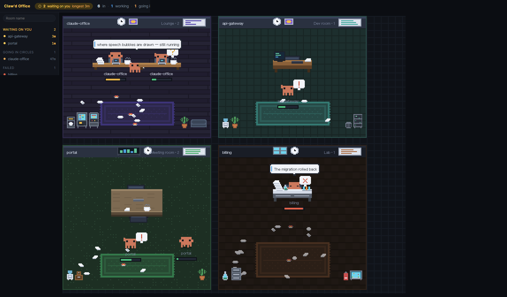
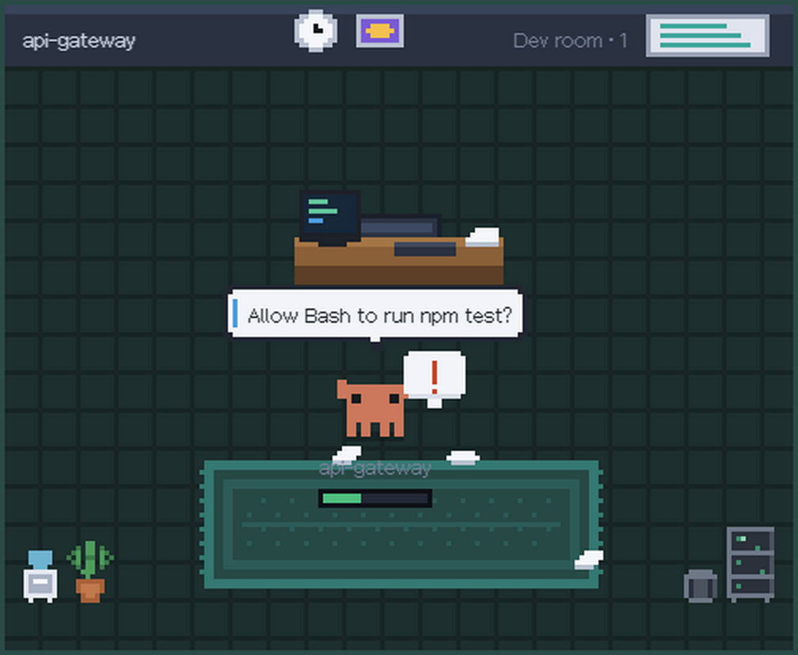
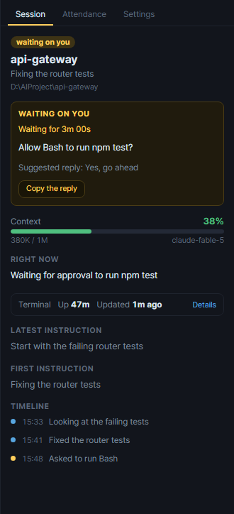
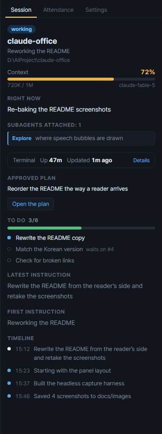
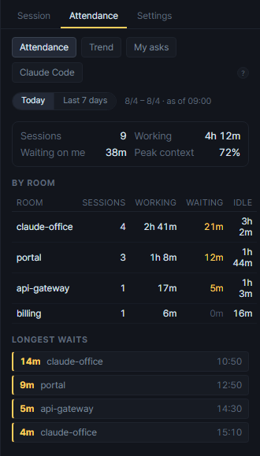
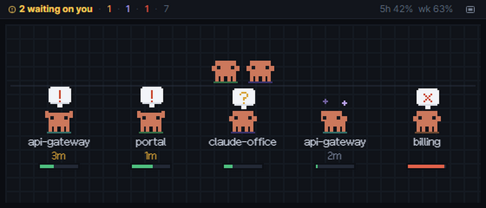

# claude-office

**English** · [한국어](README.ko.md)

A tray-resident app that draws your local Claude Code sessions as a pixel office.
**One working directory is a room; one session is one Clawd working in it.**



You leave a session running, go do something else, and come back to find it has been sitting
there for twenty minutes waiting for you to answer a permission prompt. This is the office you
glance at instead — and the nudge that comes to find you while you are looking somewhere else.

[Install](#install) ·
[Reading the office](#reading-the-office) ·
[Waiting on you](#it-will-not-let-you-miss-a-session-waiting-on-you) ·
[The panel](#the-panel) ·
[Notifications](#notifications) ·
[The window](#the-window) ·
[Limits](#limits)

## Install

**Windows** — download `Claude-Office-Setup-x.y.z.exe` from
[Releases](https://github.com/when630/claude-office/releases/latest) and run it. There is no code
signing, so if SmartScreen stops you: `More info > Run anyway`.

**macOS** — from the same place take `Claude-Office-x.y.z-arm64.dmg` (Apple Silicon) or
`-x64.dmg` (Intel) and drag the app into Applications. It is neither signed nor notarized, so
macOS will claim it "is damaged and can't be opened". Clear that once from a terminal:

```bash
xattr -cr "/Applications/Claude Office.app"
```

Nothing else to install. The app reads the same `~/.claude` files Claude Code already keeps — if
Claude Code runs on this machine, you are done.

**Updates.** The Windows build checks every four hours and downloads in the background. You get a
notification when it is ready, and either apply it right away via **tray menu > Install update and
restart** or leave it to install quietly the next time you quit. Automatic installation is blocked
for unsigned macOS builds, so there a new version gets you **a notification only** — clicking it
opens Releases.

## Reading the office

While a session works, its Clawd sits and types. With nothing to do it gets up, wanders the room,
mutters to itself and occasionally chats with a neighbour. It stops by the vending machine or the
water cooler and comes away holding a cup; the printer spits out a sheet; the arcade cabinet
blinks to itself.

| Session state | In the office |
|---|---|
| working | Sits and hammers the keyboard, code scrolling on the monitor |
| going in circles | Still at the desk, but the claws stop — a slow scratch of the head, and a ❓ |
| **no server response** | Head tilts side to side, stars spinning above it |
| **waiting on you** | Steps out in front of the desk, both claws up, holding a ❗ |
| done | Walks out onto the floor with a ✓ and goes for a stroll |
| failed · stopped | Slumped in the chair (✗ / zZ) |
| idle | Mills about the room; now and then everyone gathers on the rug (more often at lunch) |

**No server response** is not the same as going in circles. Going in circles means the session is
running but getting nowhere; this one cannot run at all because of something on Claude's side
(`API Error: 529 Overloaded` and the like) — nothing to look into, just something to wait out, so
it is counted separately. Usage limits and expired logins do not land here.

Three more things the office tells you without any text:

- **Speech bubbles.** White with a blue stripe on the left is a line actually read from the
  session. Dark is a flavour line we wrote.
- **The bar under the name tag** is that session's context usage (60% yellow · 85% red). As it
  fills, **paper piles up on the desk**; once the desk is full it starts **littering the floor**
  with sheets at every angle, crumpled paper and the odd empty can. You can spot the desk that is
  about to compact by glancing at the room rather than reading the bar.
- **An aide** with a clipboard stands beside the desk while a subagent runs, and reports its
  progress.

A room that just appeared gets a **stack of moving boxes** for a few seconds, and a room whose
work is all finished has **its lights turned down**. **After 22:00 the office dims** — room
colours still tell the rooms apart, and whoever is still around in the small hours hums to itself
with a ♪.

App text and character lines come in **English and Korean**. It follows your OS language by
default, and you can switch it in the panel's **Settings** tab or under tray menu > Language.
No restart needed.

## It will not let you miss a session waiting on you

A permission prompt, a set of choices or a plan approval leaves a session **waiting for your
answer**. Catching that is the whole point of the app.



- The crab **steps out in front of its desk** holding a ❗ and says what it is waiting for
- A **yellow dot** goes on the tray icon and an **OS notification** fires (Windows toast · macOS
  notification) — clicking it opens the window with that desk selected
- The top bar grows a **`2 waiting on you · longest 3m` chip**, the only filled shape on the
  screen. Click it and the one **waiting longest** opens. The same group stands at the top of the
  session list, counting up every second
- Answer, and the chip and the group **vanish entirely**
- Leave it and it **calls again at 5, 15, 30 and 60 minutes**; past five minutes the **tray icon
  starts blinking**. A toast slides past while you are in a meeting or full-screen — the tray
  stays where it is

Sessions merely resting at the prompt are told apart from this, so you do not get a notification
for every session that finishes.



Click the desk and the panel lays the whole thing out in one card: what is being asked, how many
minutes it has been, and — when a background job left a suggested reply — a **Copy the reply**
button. You still paste it yourself; see [Limits](#limits).

For sessions you run in a terminal, the app cannot tell **what** is being asked, because nothing
is written to the transcript while the choices are on screen. Turn on the
[Notification hook](docs/notify-hook.md) (Korean) from the tray menu and the **actual wording**
lands in the panel and in the notification.

<br clear="right" />

## The panel

Three tabs — **Session · Attendance · Settings**. Clicking a desk brings you back to Session from
wherever you were.

### Session



What that session is really up to. **The reading order is the urgency order.**

- The **waiting card** above, when this session wants an answer
- **Context gauge** — tokens · window size · model
- **Right now**, then the **subagents** attached and the instruction each was given
- One line — `Terminal · Up 47m · Updated 1m ago` — plus **Details**, which unfolds the values you
  do not read every time: model · context window · effort · Fast · PID · mode (per-session values,
  not account ones)
- **Latest instruction · first instruction · linked MRs**
- The **plan it got approved** in plan mode — its title, and a button that opens the plan file
- The session's own **to-do list** — `2/6` with a progress bar and whatever is still open. Only
  the item in progress is bright; ones waiting their turn are marked `waits on #3`. Sessions that
  never wrote a list get no block at all
- **Timeline** — instructions received (yellow) ↔ things said (blue)
- **Open in terminal**, pinned to the bottom so it never scrolls out of reach however long the
  rest gets. It launches a terminal in that session's working directory and reattaches to it; with
  Windows Terminal it comes up as a new tab in the open window. The button beside it hands you
  just the command

With nothing selected, the default view is an **office summary** and your **account usage**
(5-hour session · 7-day week). Usage only appears once a tap is installed in your statusline — the
tray menu's **Usage feed (statusline)** sets that up for you. The **question mark** in the bottom
right explains how to read the bubbles.

<br clear="right" />

### Attendance



The office shows you how many are waiting right now, but **without a record there is no way to
know how many minutes you left them waiting today.**

- Today · last 7 days — session count · time working · **time spent waiting on me** · peak context
- A per-room breakdown and the **longest waits** (only those over a minute)
- A **7-day trend** of that waiting time, so you can see whether it is getting better. Days the
  app was closed are left blank with a dashed baseline rather than drawn as a zero
- What gets recorded stops at state transitions and room names. Session names, paths and
  instructions are not kept, and entries are retained for 14 days. You can turn it off or clear it
  from the tray menu

<br clear="right" />

### Settings

Language · masking names · room types · grouping and aliases · pinned and collapsed rooms ·
notification kinds and per-room levels · quiet hours · the three global shortcuts.

The tray menu and this tab write the same file — `%APPDATA%\claude-office\settings.json`
(`~/Library/Application Support/claude-office/settings.json` on macOS).

## Notifications

Each kind goes on and off in the tray menu under **Notifications**, or in the panel's Settings
tab.

| Kind | Fires when | Default |
|---|---|---|
| Waiting on you | a session wants an answer | on |
| Repeat nudge | it is still unanswered at 5 · 15 · 30 · 60 min | on |
| Context running out | 85% · 95% — before auto-compaction trims the session's memory | on |
| Account usage running out | 80% · 95%, once the statusline tap is in place | on |
| Work finished | a job that took over **three minutes** ends — carries how long it took and where it left off | off |
| Looks stuck | tools fail three times running, or ten minutes pass with nothing written to the transcript | off |

Work finished and Looks stuck are off by default on purpose. Short exchanges finishing would be
noise, and long builds are legitimately quiet — which is exactly why the stuck threshold sits
where it does.

- **Play a sound too** adds an audible alert to the toast. It is off by default and **never fires
  on a repeat nudge** — a sound every 5, 15, 30 and 60 minutes is torture
- **Quiet hours** in Settings (`22:00 ~ 09:00` and other ranges crossing midnight are fine) hold
  the toasts back. To go quiet for a short while right now, use tray menu > Notifications >
  **Silence from now** (30 min · 1 hour · rest of today). While quiet, the **tray icon and the
  top-bar count stay exactly as they are** — it goes silent, it does not let you miss anything
- Each room gets its own **alert level** — `No alerts` for a scratch folder you never want to hear
  from, `Keen` for one you cannot miss (repeat nudges move in to 1 · 3 · 10 · 30 min)

## The window

### Living in the tray

- Closing the window does not quit — it drops to the tray (menu bar on macOS). To really quit:
  **tray icon > Quit**
- The tray icon carries the state — Clawd normally, a yellow dot when something is waiting on you,
  a red dot when something failed. Hover for `5 in office · 3 working · 1 waiting on you
  (longest 12m)`
- **Waiting on you** in the tray menu lists whatever is waiting, longest first — click one and
  **its terminal opens right there**. No need to open the window and hunt for the desk
- **Start at login** brings the app up in the tray only, with no window

### Shrink it to a corner



The `▭` button in the top bar (or the tray menu) drops the office into a small frameless window
that stays **always on top**. No rooms here — just the crabs, **gathered in one place**.

- The **front row** is whoever is waiting on you, stuck, cut off by a server outage or failed, with
  a name and how long it has been like that. No waiting, no front row
- The **back row** is everyone working, unnamed
- Nobody wanders in this window — there is no reason to chase a moving target in a view you only
  glance at
- **Hover a crab** and the one-line header tells you which room it is in and how full its context
  is; click it and the window grows back with that session selected
- The right end of that line carries the session (5h) and weekly usage. It folds away first on a
  narrow window, so the waiting count never gets clipped
- Size, position and mode are remembered, so it comes back the way you left it

<br clear="right" />

### Or send them out onto the desktop

The other button (or the tray menu) does away with the window altogether. The office becomes a
transparent sheet over your desktop and **only the crabs are left**, walking along the bottom of
the screen.

- Give a session work and its crab stops where it stands, **pulls out a laptop and gets to work**.
  When the work ends it folds the laptop away and carries on walking
- Whoever is waiting on you stands still with both claws up and a `❗` — same as everywhere else.
  Stuck, cut off, failed and stopped all keep the faces they have in the office
- **Pick one up and drop it wherever you like.** It dangles from your cursor, legs hanging, and
  falls back to the floor when you let go
- **Hover** for the room and session name; **click** and the full window comes back with that
  session selected
- Anywhere that is not a crab **clicks straight through** to whatever is underneath — the sheet is
  not there as far as your mouse is concerned
- Crowded machines stay readable: at most **six crabs** go out at a time, most urgent first
  (waiting, stuck, cut off, failed, then the rest). Raise it with `view.strollMax` in
  `settings.json` if you want more

The three modes are exclusive — the window, the corner, and the desktop. Switch between them from
the top bar, the tray menu, or the shortcuts.

### Moving the office around

| | |
|---|---|
| Move a room | **drag its name strip** (`Esc` cancels) |
| Zoom | `Ctrl+wheel`, or pinch on a trackpad |
| Move it | `Space+drag`, or a middle-button drag |
| Scroll | the wheel vertically, `Shift+wheel` horizontally |
| Back to the middle | tap `Space` |
| Back to auto scale and centre | `Ctrl+0` (`Ctrl+=` · `Ctrl+-` step the scale) |
| Fold either side column | `Ctrl+[` · `Ctrl+]`, or the two buttons in the top bar |

`⌘` stands in for `Ctrl` on macOS.

**The layout does not follow the window size.** Rooms sit in a grid of cells, so shrinking the
window only draws them smaller — the number of rows and the shape of each room stay put, and a
small resize can't re-shuffle the office out from under the room you were watching. You place the
rooms yourself by dragging the name strip (they snap to cells, and dropping one on an occupied cell
swaps the two), and where you put them is saved. To start over: **Settings > Rooms > Reset room
layout**.

Whatever sat under the cursor **stays** under it, so you don't lose the one you were watching.
Tapping `Space` to recentre is the same reflex as the spacebar in StarCraft. Dragging isn't pinned
to the top-left corner, so any room can be brought to the centre of the screen — and it stops
there, so the office can never be dragged off-screen.

Scale steps go in halves from 2× to 8×, as fine as stays crisp. Left alone it picks the largest
step that **fits the office in the window** (between 3× and 4×); past that you drag to look around.
The scale is **not** saved. Folded columns are: fold both and the window is all office, across
restarts.

### Once there are a lot of rooms

- The **session list** on the left groups everything by state — waiting on you · going in circles ·
  no server response · failed · working · resting · clocked out. The urgent group is always on top, so twenty rooms
  need no scanning. Click a row to open that desk; click a desk in the office and the row
  highlights to match
- **Filter them by name** in the box above the list. Pin the ones you watch with `☆` in Settings
  and collapse the rest — all three change the view only, so a collapsed room still nudges you. A
  `3 hidden` badge appears while anything is out of sight, and clicking it clears the lot
- When one repo spreads over several working directories, Settings lets you **⊞ group everything
  under a parent into one room** and give a cryptic name like `src` an **alias**. Attendance is not
  grouped — it keeps recording the working-directory name, so changing the rule never breaks
  continuity with past records

### Global shortcuts

| | Windows | macOS |
|---|---|---|
| Show and hide the window | `Ctrl+Alt+O` | `⌥⌘O` |
| Open the terminal of the longest wait | `Ctrl+Alt+W` | `⌥⌘W` |
| Toggle the mini window | `Ctrl+Alt+M` | `⌥⌘M` |
| Toggle the desktop stroll | `Ctrl+Alt+S` | `⌥⌘S` |

Rebind them in Settings. A combination another app already holds is **marked in red** there,
rather than leaving you with a shortcut that quietly does nothing.

## Limits

- **Local sessions only.** Sessions run from `claude.ai/code` (web) or the desktop app leave
  nothing in these files, so they do not show up
- **It cannot answer or stop a session for you.** That would mean writing to someone else's
  terminal stdin, so it does not — when you spot one waiting, it takes you as far as **Open in
  terminal** and no further
- **It does not send your work anywhere.** Everything on screen is read from files already on your
  machine; the only thing that leaves it is the check for a new release
- Account usage depends on the statusline tap. A Claude Code session has to paint its statusline
  once before there is a value, and anything older than 30 minutes is marked stale
- Attendance is only recorded **while the app is running.** Whatever happened between quitting and
  starting again is not there
- The app speaks **English and Korean only**, and text read from a session (titles, instructions,
  activity) is not translated — those are the session's own words. The documents under `docs/` are
  Korean only
- When the window is covered or on another virtual desktop the animation stops and picks up where
  it left off once the window is visible again — that is the browser engine saving your battery,
  not a hang. **The desktop stroll is the exception and keeps running** — a mascot that freezes
  the moment something covers it is no use at the corner of your eye
- The stroll only covers the **work area of your primary display**. With several monitors the crabs
  stay on the main one, and they do not climb over fullscreen apps
- Builds are not code signed — on Windows that means the SmartScreen warning, and on macOS one
  `xattr -cr` before first launch plus manual updates
- The `~/.claude` layout is Claude Code's internal arrangement and can change between versions
  (checked against v2.1.220)
- Installing the usage tap automatically only works when your statusline is PowerShell (`.ps1`).
  For bash and friends, add the one line by hand as the tray menu's guide shows and it behaves
  identically

## Further reading

The documents under `docs/` are in Korean.

| Document | Contents |
|---|---|
| [What it is waiting for](docs/notify-hook.md) | Installing the Notification hook to capture permission and choice prompts |
| [Attendance](docs/attendance.md) | What is recorded · how time is counted · turning it off and clearing it |
| [Settings](docs/settings.md) | Language · masking names · picking room types |
| [The right-hand panel](docs/panel.md) | Panel layout · opening a terminal · how the usage tap works |
| [Room types](docs/rooms.md) | The 8 rooms and their props |
| [What the characters do](docs/characters.md) | How "waiting" is decided · bubbles · aides · the pixel rules |
| [What it reads](docs/data-sources.md) | Which `~/.claude` files and how |
| [Architecture](docs/architecture.md) | How the app is put together · debug entry points |

---

MIT. The pixel font inside the office is the 12px Korean variant of
[Mona](https://github.com/MonadABXY/mona-font) (SIL OFL 1.1).
