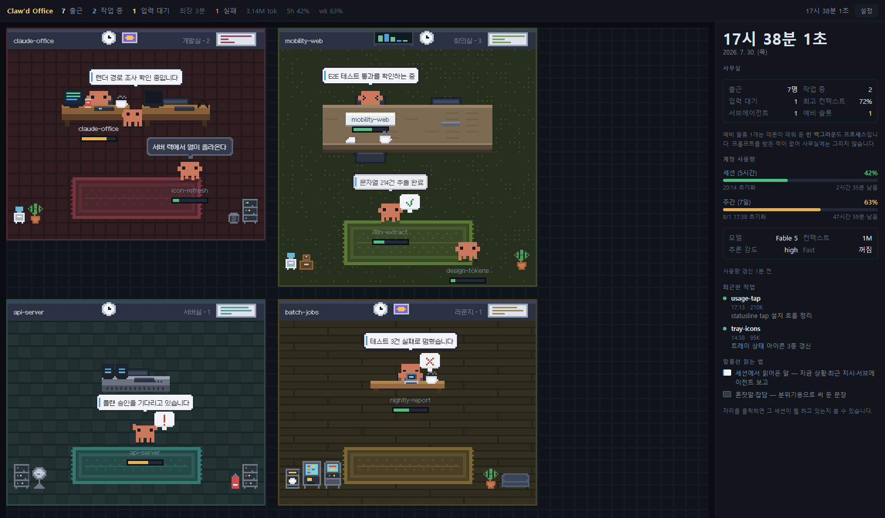
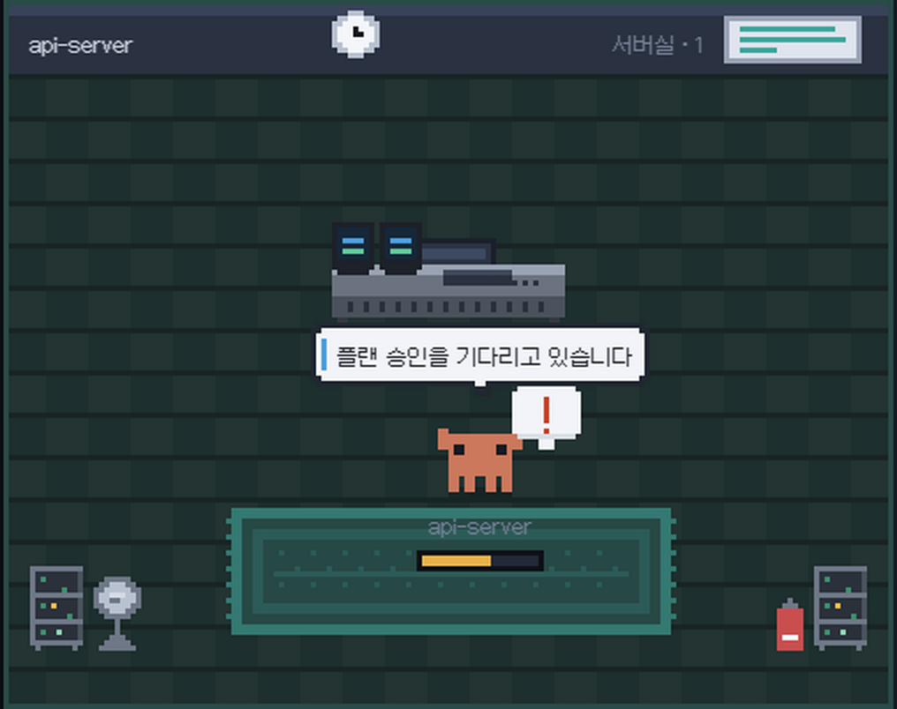
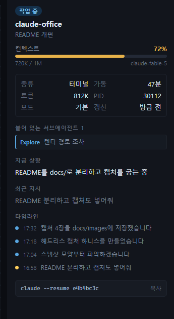

# claude-office

로컬에서 돌아가는 Claude Code 세션들을 픽셀 사무실로 보여주는 트레이 상주 앱.
작업 디렉터리 하나 = 사무실 한 칸, 세션 하나 = 그 방에서 일하는 클로드 한 마리.



일하는 동안엔 자리에 앉아 타이핑하고, 일이 없으면 자리에서 일어나 방을 돌아다니며
혼잣말을 하고 가끔 옆자리와 잡담을 한다. 말풍선이 흰색(왼쪽 파란 띠)이면 세션에서
실제로 읽어온 말이고, 어두우면 분위기용 대사다.

| 세션 상태 | 사무실에서는 |
|---|---|
| 작업 중 | 자리에 앉아 키보드를 두드리고, 모니터에 코드가 흐른다 |
| **입력 대기** | 자리에서 일어나 두 팔을 들고 ❗ — 아래 참고 |
| 완료 | ✓를 들고 바닥으로 걸어 나가 산책한다 |
| 실패 · 정지 | 의자에 늘어져 있다 (✗ / zZ) |
| 대기 | 방을 어슬렁거리고, 가끔 다 같이 러그에 모인다 |

서브에이전트가 돌고 있으면 자리 옆에 결재판을 든 **비서**가 서서 진행 상황을 보고하고,
이름표 아래 막대는 그 세션의 **컨텍스트 사용률**이다 (60% 노랑 · 85% 빨강).

## 입력 대기를 놓치지 않는다

이 앱의 존재 이유. 권한 확인·선택지·플랜 승인으로 **내 답을 기다리는 세션**이 생기면 —



- 게가 자리 앞에 나와 ❗를 들고 서고, 무엇을 기다리는지 말풍선으로 말한다
- 트레이 아이콘에 **노란 점**이 붙고, **OS 알림**(Windows 토스트 · 맥 알림)이 뜬다 — 누르면 창이 열리며 그 자리가 선택된다
- 상단바에 `1 입력 대기 · 최장 3분`처럼 가장 오래 방치된 시간이 쌓인다
- 답하지 않고 두면 **5 · 15 · 30 · 60분째에 다시 부르고**, 5분을 넘기면 **트레이 아이콘이 깜빡인다** —
  토스트는 스쳐 지나가지만(회의 중이었거나 전체화면이었거나) 트레이는 계속 그 자리에 있다

프롬프트 앞에서 그냥 쉬는 세션(`idle`)과는 구분하므로, 끝난 세션마다 알림이 울리지는 않는다.
판정 원리는 [캐릭터가 하는 짓](docs/characters.md#선택지가-뜨면-산책하지-않는다) 참고.

## 오른쪽 패널



자리를 클릭하면 그 세션의 속사정이 나온다.

- **컨텍스트 게이지** — 토큰 · 창 크기 · 모델
- 붙어 있는 **서브에이전트**와 받은 지시
- **지금 상황 · 최근 지시 · 연결된 MR**
- **타임라인** — 받은 지시(노랑) ↔ 한 말(파랑)
- 맨 아래 **터미널에서 열기** — 그 세션의 작업 디렉터리에서 `claude attach <id>`
  (터미널 세션은 `claude --resume <sessionId>`)를 실행하는 터미널을 띄운다.
  Windows Terminal이 있으면 열려 있는 창에 새 탭으로 붙는다. 옆의 **복사 버튼**으로
  명령만 받아 갈 수도 있다

아무것도 선택하지 않으면 시계와 **계정 사용량**(세션 5시간 · 주간 7일)이 기본 화면이다.
사용량은 statusline에 tap을 심어야 나온다 — [사용량 연동](docs/panel.md#사용량은-왜-tap이-필요한가) 참고.

<br clear="right" />

## 출근부

상단바 **출근부** 버튼. 지금 몇 개가 대기 중인지는 사무실이 보여주지만,
**하루에 몇 분을 방치했는지는 기록이 없으면 알 수 없다.**

- 오늘 · 최근 7일 — 세션 수 · 작업 시간 · **내가 답을 기다리게 한 시간** · 최고 컨텍스트
- 방별 내역과 **오래 기다리게 한 순간** (1분 이상만)
- 남기는 것은 상태 전이와 방 이름까지다. 세션 이름·경로·지시 내용은 남기지 않고,
  보존은 14일. 트레이 메뉴에서 끄거나 지울 수 있다

자세한 규칙은 [출근부](docs/attendance.md) 참고.

## 설치와 업데이트

**Windows** — [Releases](https://github.com/when630/claude-office/releases/latest)에서
`Claude-Office-Setup-x.y.z.exe`를 받아 실행한다. 코드 서명이 없어 SmartScreen 경고가 뜨면
`추가 정보 > 실행`. 설치본은 4시간마다 새 릴리즈를 확인해 백그라운드로 받아 두고 —
준비되면 알림이 뜨고, **트레이 메뉴 > 업데이트 설치하고 재시작**으로 바로 적용하거나
그냥 두면 다음 종료 때 조용히 설치된다.

**macOS** — 같은 곳에서 `Claude-Office-x.y.z-arm64.dmg`(Apple Silicon) 또는
`-x64.dmg`(Intel)를 받아 앱을 Applications에 끌어 넣는다. 서명·공증이 없어
"손상되었기 때문에 열 수 없습니다"가 뜨는데, 터미널에서 한 번만 풀어주면 된다:

```bash
xattr -cr "/Applications/Claude Office.app"
```

서명 없는 맥 빌드는 자동 설치가 막혀 있어(Squirrel.Mac이 서명을 검증한다),
새 버전이 나오면 **알림만** 뜬다 — 누르면 Releases가 열린다.

## 개발

```powershell
npm install       # 아이콘은 postinstall이 굽는다
npm start         # 개발 실행
npm test          # 알림 문턱·attach 명령 판정 (의존성 없이 node --test)
npm run usage-tap # 세션·주간 사용률을 앱이 읽게 statusline에 한 줄 심는다 (선택)
npm run build     # dist/ 에 Windows 설치본(NSIS) 생성
npm run build:mac # 맥에서 실행하면 dmg+zip 생성 (Windows에서는 못 굽는다)
```

릴리스는 태그를 푸시하면 CI가 한다 — Windows·macOS를 다 빌드해 Releases **초안**에 올리므로,
[Actions](https://github.com/when630/claude-office/actions)가 끝나면 릴리스 노트를 쓰고 Publish 한다.

```powershell
git tag v0.4.0; git push origin v0.4.0
```

Electron 43 · 런타임 의존성은 자동 업데이트(electron-updater) 하나.
`claude agents`가 쓰는 것과 같은 `~/.claude` 파일들을 직접 읽으므로 Claude Code 외에 아무것도 필요 없다.

## 트레이 상주

- 창을 닫아도 종료되지 않고 트레이(맥은 메뉴바)로 내려간다. 진짜 종료는 **트레이 아이콘 > 종료**
- 트레이 아이콘이 상태를 물고 있다 — 평소엔 클로드, 입력 대기가 생기면 노란 점, 실패가 있으면 빨간 점.
  마우스를 올리면 `5명 출근 · 3 작업 중 · 1 입력 대기 (최장 12분)`
- 트레이 메뉴 **알림**에서 종류별로 켜고 끈다 — 입력 대기 · 대기 재알림 ·
  **컨텍스트 임박**(85 · 95%) · **계정 사용량 임박**(80 · 95%).
  컨텍스트는 자동 압축이 돌아 세션의 기억이 잘리기 전에 알려주는 쪽이고,
  사용량은 statusline 연동이 붙어 있을 때만 나온다
- **로그인 시 자동 시작**(창 없이 트레이에만 올라온다), **사용량 연동(statusline)**,
  **근태 기록**([출근부](docs/attendance.md))도 트레이 메뉴에 있다 —
  쌓인 근태 기록을 지우는 항목도 여기 있다
- 설정은 `%APPDATA%\claude-office\settings.json`
  (맥은 `~/Library/Application Support/claude-office/settings.json`) —
  트레이 메뉴와 상단바 [설정](docs/settings.md)이 같은 파일을 쓴다

## 더 읽을 것

| 문서 | 내용 |
|---|---|
| [무엇을 읽는가](docs/data-sources.md) | `~/.claude`의 어떤 파일을 어떻게 읽나 · 예비 슬롯 · 터미널 세션 트랜스크립트 파싱 |
| [사무실 종류](docs/rooms.md) | 8종 방과 비품 · 회의실만 배치가 다른 이유 |
| [캐릭터가 하는 짓](docs/characters.md) | 16×12 픽셀 규칙 · 전환 애니메이션 · 입력 대기 판정 · 말풍선 · 비서 |
| [오른쪽 패널](docs/panel.md) | 패널 구성 · 픽셀 폰트 · 사용량 tap의 원리 |
| [출근부](docs/attendance.md) | 무엇을 남기나 · 시간을 어떻게 세나 · 끄기와 지우기 |
| [설정](docs/settings.md) | 이름 가리기 · 방 종류 고르기 |
| [구조](docs/architecture.md) | 파일 지도 · 손댈 만한 곳 · 디버그 입구 |

## 한계

- **로컬 전용**이다. `claude.ai/code`(웹)나 데스크톱 앱에서 돌린 세션은 이 파일들에 남지 않아 보이지 않는다
- 세션에 **답장하거나 정지시킬 수는 없다.** 남의 터미널 stdin을 건드리는 일이라 하지 않는다 —
  대기 중인 놈을 발견하면 [터미널에서 열기](docs/panel.md#터미널에서-열기)로 그 자리까지 데려다주는 것까지가 전부다
- 계정 사용량은 statusline tap에 의존한다. Claude Code 세션에서 statusline이 한 번 그려져야 값이 생기고,
  30분 넘게 갱신이 없으면 "오래됨"으로 표시한다
- 창이 가려져 있거나 다른 가상 데스크톱에 있으면 Chromium이 `requestAnimationFrame`을 멈춘다 —
  캔버스가 안 그려지는 게 정상이고, 창을 다시 보이게 하면 이어서 움직인다
- 출근부는 **앱이 켜져 있던 동안만** 기록한다. 껐다 켠 사이에 벌어진 일은 남지 않는다
- `~/.claude` 구조는 Claude Code 내부 규약이라 버전이 오르면 바뀔 수 있다 (확인 시점: v2.1.220)
- 빌드본은 코드 서명이 없다 — Windows는 SmartScreen 경고(`추가 정보 > 실행`),
  맥은 첫 실행 전 `xattr -cr` 한 번과 수동 업데이트를 감수해야 한다
- 사용량 연동 자동 설치는 statusline이 PowerShell(.ps1)일 때만 된다 — bash 등은
  트레이 메뉴가 띄우는 안내대로 한 줄을 손으로 넣으면 똑같이 동작한다

---

사무실 안 픽셀 폰트는 [Mona](https://github.com/MonadABXY/mona-font)의 12px 한글 변형 (SIL OFL 1.1).
캡처는 실제 렌더러를 헤드리스로 돌려 구운 것이다 — [디버그 입구](docs/architecture.md#디버그-입구) 참고.
